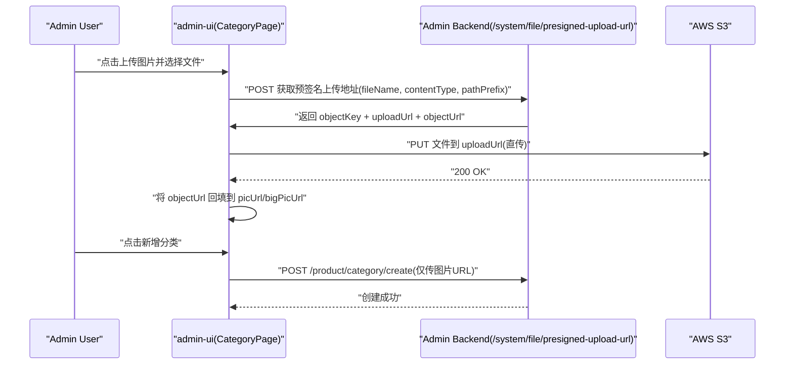

# admin-ui

e-store 管理后台前端项目（React + TypeScript + Vite + MUI）。

## 1. 项目定位

`admin-ui` 是管理端（Admin）Web 控制台，主要面向运营/管理人员。

当前重点模块为商品中心，对齐 eg 管理后台的核心能力：
- 商品品牌
- 商品分类
- 商品属性
- 属性值管理
- 商品 SPU
- 商品评论

## 2. 技术栈

- React 18
- TypeScript
- Vite 6
- React Router v6（路由懒加载）
- MUI（`@mui/material` + `@mui/icons-material` + emotion）
- Axios

## 3. 目录结构

```text
admin-ui/
├─ src/
│  ├─ api/
│  │  ├─ http.ts                 # axios 实例、统一响应处理、401 处理
│  │  ├─ admin/
│  │  │  ├─ auth.ts              # 登录/登出/权限信息
│  │  │  ├─ product.ts           # 商品相关接口
│  │  │  └─ index.ts
│  │  └─ app/
│  ├─ components/
│  │  ├─ ConfirmDialog.tsx
│  │  ├─ PromptDialog.tsx
│  │  └─ Pagination.tsx
│  ├─ layout/
│  │  └─ AdminLayout.tsx         # 顶部栏 + 可收起侧边栏
│  ├─ pages/
│  │  ├─ LoginPage.tsx
│  │  ├─ DashboardPage.tsx
│  │  └─ product/
│  │     ├─ BrandPage.tsx
│  │     ├─ CategoryPage.tsx
│  │     ├─ PropertyPage.tsx
│  │     ├─ PropertyValuePage.tsx
│  │     ├─ SpuPage.tsx
│  │     ├─ SpuFormPage.tsx
│  │     └─ CommentPage.tsx
│  ├─ router/index.tsx           # 路由定义、鉴权守卫
│  ├─ theme.ts                   # MUI 主题
│  └─ main.tsx
├─ vite.config.ts                # 本地代理配置
└─ package.json
```

## 4. 本地开发

### 4.1 安装依赖

```bash
npm install
```

### 4.2 启动开发环境

```bash
npm run dev
```

默认端口：`5173`

### 4.3 构建与预览

```bash
npm run build
npm run preview
```

### 4.4 代码检查

```bash
npm run lint
```

## 5. 环境变量与接口代理

### 5.1 API Base

`src/api/http.ts` 中默认读取：
- `VITE_ADMIN_API_BASE`
- 未配置时默认：`/api-admin`

### 5.2 Vite 本地代理

`vite.config.ts` 默认将 `/api-admin` 代理到：
- `http://127.0.0.1:8092`

并重写前缀（`/api-admin` -> ``）。

如后端地址变化，可修改：
- `vite.config.ts` 中 `server.proxy['/api-admin'].target`
- 或通过 `VITE_ADMIN_API_BASE` 指向网关地址

## 6. 登录与鉴权

### 6.1 登录流程

- 登录接口：`POST /system/auth/login`
- 成功后保存：
  - `admin_token`
  - `admin_refresh_token`

### 6.2 路由守卫

`src/router/index.tsx` 的 `RequireAuth` 会：
- 检查本地 token
- 调用 `GET /system/auth/get-permission-info` 验证 token 有效性
- 无效时清理 token 并跳转 `/login`

### 6.3 全局 401 处理

`src/api/http.ts` 拦截器在收到 `401` 时会：
- 清理 token
- 强制跳转登录页

## 7. UI 与交互约定（当前实现）

- 组件库统一使用 MUI
- 左侧导航支持收起；收起后仅展示图标（带 tooltip）
- 列表页“新增”按钮统一放在标题行右侧
- 新增/编辑优先使用弹窗表单（Dialog）
- 删除/回复等二次确认使用统一 Dialog 组件
- 管理后台默认不做移动端适配（以桌面端为主）

## 8. 主要页面说明

### 8.1 商品品牌

- 列表查询、分页
- 新增/编辑（弹窗）
- 删除

### 8.2 商品分类

- 分类树平铺展示
- 新增/编辑（弹窗）
- 删除
- 子分类可跳转查看商品

### 8.2.1 分类图片上传时序（客户端直传 S3）



关键说明：
- 文件内容不经过业务服务端，服务端只负责下发预签名上传 URL。
- 分类创建接口只接收图片 URL（`picUrl` / `bigPicUrl`）。
- 上传失败会在分类弹窗内提示错误，不影响表单其他字段编辑。

### 8.3 商品属性 / 规格值

- 列表查询、分页
- 新增/编辑（弹窗）
- 删除
- 规格与规格值联动

### 8.4 商品 SPU

- 按状态（出售中/仓库中/回收站）切换
- 列表查询、分页、上下架/回收/恢复/删除
- 新增（弹窗快速表单）
- 详情/编辑（`SpuFormPage`）

### 8.5 商品评论

- 查询、分页
- 新增评论（弹窗）
- 回复评论（弹窗）
- 显示/隐藏切换

## 9. 接口返回约定

后端返回结构（admin 侧）按以下解析：

```ts
interface OutResp<T> {
  code: number;
  desc: string;
  enDesc?: string;
  data: T;
}
```

前端约定：
- `code === 200` 视为成功，返回 `data`
- 其余状态抛错，错误文案优先 `desc`

## 10. 开发建议

- 新页面优先沿用现有模式：
  - `api/admin/*.ts` 定义接口与类型
  - 页面用 MUI 组件搭建
  - 列表页统一使用 `Pagination` 组件
  - 二次确认统一用 `ConfirmDialog` / `PromptDialog`
- 新增菜单时同步更新：
  - `src/layout/AdminLayout.tsx`（导航）
  - `src/router/index.tsx`（路由）

## 11. 常见问题

### 11.1 登录后立刻跳回登录页

通常是 token 校验失败：
- 检查后端 `GET /system/auth/get-permission-info` 是否可用
- 检查 `Authorization` 是否透传到后端

### 11.2 页面请求 404/跨域

- 检查 `vite.config.ts` 代理 target
- 检查后端服务地址与端口
- 检查请求 baseURL（`VITE_ADMIN_API_BASE`）

### 11.3 新增/编辑报错不明显

当前多数页面已在弹窗内展示表单错误；如果新增页面请保持同样交互，避免仅在页面顶部提示。

---

如需继续扩展（订单、会员、营销等），建议保持与当前商品模块相同的信息架构和交互模式，降低维护成本。
